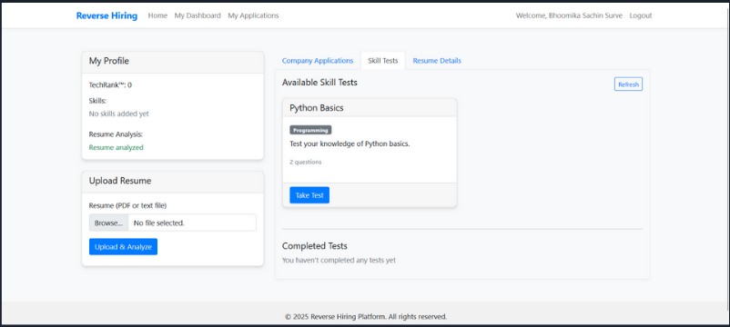
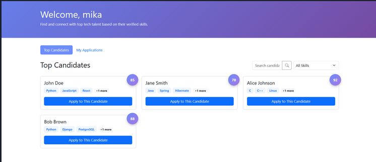
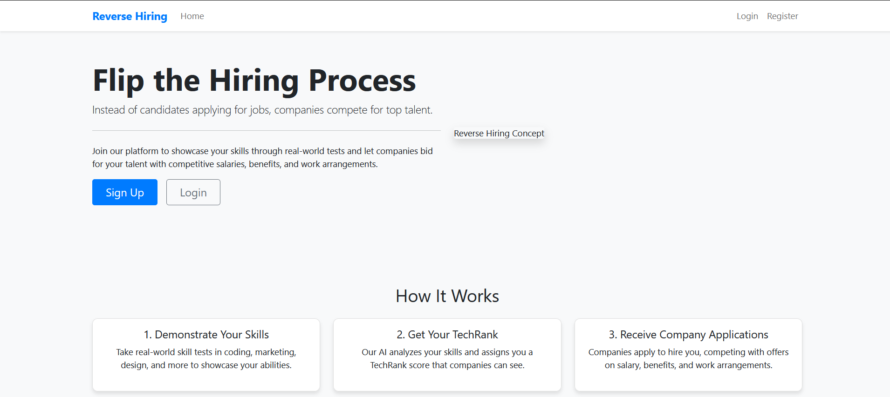

# Reverse Hiring Platform 🚀

Reverse Hiring Platform is an innovative web application that **reverses the traditional recruitment model** — allowing **candidates** to showcase their skills and **companies** to approach the candidates, based on their verified **TechRank™** and **skill assessments**.

Built with **Flask**, **MongoDB**, and **Google Gemini-Pro (GenAI)**, the platform automates skill extraction from resumes, provides coding and MCQ tests, and creates a powerful two-way marketplace for job hiring.

---

## 🌟 Overview

The Reverse Hiring Platform empowers candidates to **take control** of their hiring journey.

- **Candidates** upload their resume ➔ AI extracts their skills ➔ candidates take skill tests ➔ based on TechRank™ and skill profile, companies **approach** candidates with offers.
- **Companies** can search, filter, and apply to candidates, offering positions with salaries, benefits, and messages, all through an interactive dashboard.

This creates a **skills-first**, **candidate-driven** hiring process, removing bias and ensuring **real merit** gets rewarded.

---

## 🧩 Core Features

### 🔹 Candidate Features:
- **Registration & Login** (securely using bcrypt hashing)
- **Resume Upload and AI Analysis** (using Google Gemini-Pro for skill extraction)
- **Profile Completion** (Education, Experience, Skills)
- **Skill Tests** (MCQ + coding questions with real scoring)
- **TechRank™ Score Calculation** (dynamic based on tests + resume)
- **Dashboard** to view job applications, accept/reject offers

### 🔹 Company Features:
- **Company Registration & Login**
- **Talent Search** by skills and minimum TechRank
- **View Full Candidate Profiles**
- **Offer Application to Candidates** (custom job offers with salary, benefits, and messages)
- **Dashboard** to manage candidate applications and responses

---

## 🛠️ Technologies Used

- **Backend**: Python, Flask
- **Frontend**: HTML5, Bootstrap 5, Vanilla JS, Jinja2 Templating
- **Database**: MongoDB (using PyMongo)
- **Authentication**: Flask-Session, bcrypt
- **AI Skill Extraction**: Google Gemini-Pro (Generative AI)
- **APIs**: Simulated Coding Evaluation (future-ready for JDoodle/HackerRank APIs)

---

## 🧪 Skill Tests

**Each skill test includes:**

        MCQs (Multiple-choice questions)

        Code Challenge (Optional)

        Real Scoring (Mocked in this version for demo)

  **Tests are linked with skill categories (Python, HTML, etc.)**

  **Taking more tests improves TechRank™, enhancing candidate visibility.**

## Screenshots





## 🗂️ Project Structure

```plaintext
/ (root)
│
├── app.py                # Main Flask application
├── templates/            # Jinja2 HTML templates
│   ├── base.html
│   ├── index.html
│   ├── about.html
│   ├── register.html
│   ├── login.html
│   ├── candidate_dashboard.html
│   ├── company_dashboard.html
│   └── ...other templates
├── static/               # CSS, JS, images


